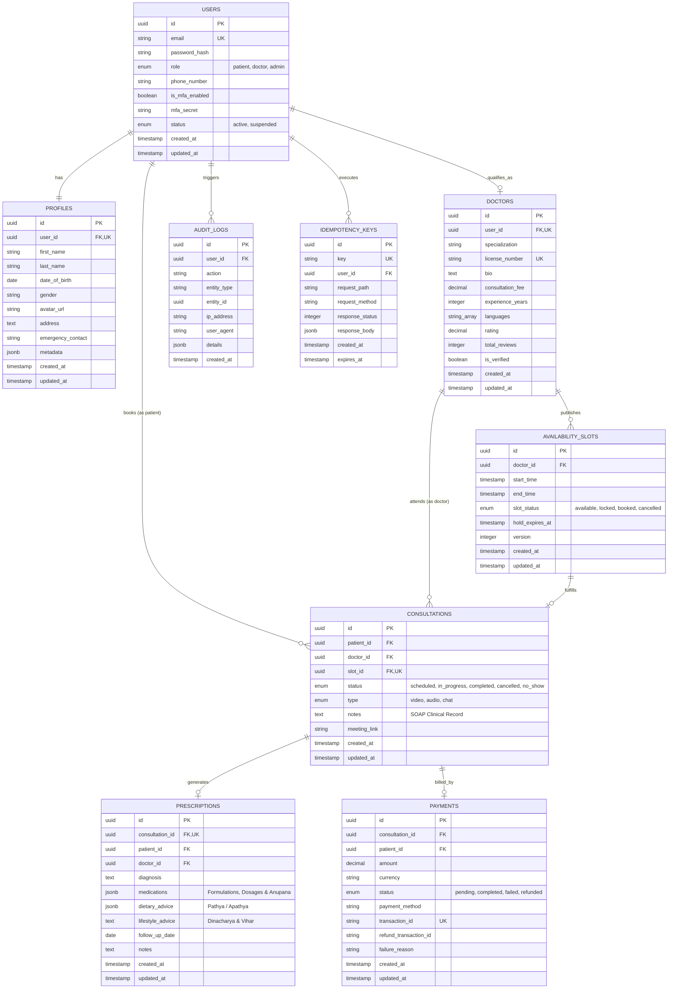

# Amrutam Telemedicine System — Master Technical Architecture Document

> **Document Version**: 2.1.0  
> **Source Specification**: `PRD/Backend Developer Assignment new.pdf` & `BLUEPRINT.md`  
> **Target Scale**: 100,000 daily consultations  
> **Availability SLA**: 99.95% uptime  
> **Performance SLA**: Latency p95 < 200ms (reads), < 500ms (writes), sub-50ms (cached hits)  
> **Security Standards**: RBAC, MFA (TOTP RFC 6238), Write Idempotency, JWT Token Blacklisting, Data Classification (PII/PHI)  

---

## 1. Executive Summary & Problem Scope

Amrutam is India’s premier holistic Ayurvedic platform, connecting patients globally with verified practitioners across traditional specialties including *Kayachikitsa* (Internal Medicine), *Panchakarma* (Detoxification), and *Shalya Tantra* (Surgical & Wound Care).

This document details the complete production architecture engineered to handle **100,000 consultations daily** (~70 bookings/minute average with flash peak surges up to 1,500 bookings/minute). The system guarantees:
- **Zero Double-Bookings**: Achieved via a two-tier concurrency engine combining Redis distributed locks (`SET NX EX`) and PostgreSQL pessimistic row-level locks (`SELECT ... FOR UPDATE`).
- **Sub-200ms Response Times**: Multi-level caching (Upstash Redis) and composite indexing on query paths.
- **Financial & Clinical Ledger Integrity**: Choreographed Sagas with automatic compensating rollbacks on payment failure, and legally immutable digital prescriptions.
- **Non-Repudiation Compliance**: Append-only audit trails capturing actor, IP, User-Agent, and state diff payloads.

---

## 2. High-Level System Architecture

```mermaid
graph TD
    Client[Patient / Doctor / Admin Client] --> Ingress[Ingress / Security Layer]
    
    subgraph Edge & API Gateway
        Ingress --> Helmet[Helmet Security Headers]
        Ingress --> Corr[Correlation ID Middleware]
        Ingress --> MetricsMW[Prometheus Metrics Middleware]
        Ingress --> RateLimiter[Redis Sliding-Window Rate Limiter]
        Ingress --> IdemMW[Write Idempotency Filter]
        Ingress --> AuthMW[JWT & RBAC Middleware]
    end

    subgraph Application Service Mesh
        AuthMW --> M1[Module 1: User & Auth Service]
        AuthMW --> M2[Module 2: Doctor & Schedule Engine]
        AuthMW --> M3[Module 3: Concurrency Booking Engine]
        AuthMW --> M4[Module 4: Consultation Lifecycle Engine]
        AuthMW --> M5[Module 5: Prescription & EHR Service]
        AuthMW --> M6[Module 6: Payment & Saga Ledger]
        AuthMW --> M7[Module 7: Discovery & Search Engine]
        AuthMW --> M8[Module 8: Compliance Audit Logger]
        AuthMW --> M9[Module 9: Admin Analytics Engine]
        AuthMW --> M10[Module 10: Async Task Queue & Workers]
    end

    subgraph Acceleration & Concurrency Layer
        M1 & M2 & M3 & M6 & M7 & M8 & M9 & M10 --> UpstashRedis[(Upstash Redis Cache, Mutex & Job Store)]
    end

    subgraph Persistent Storage Layer
        M1 & M2 & M3 & M4 & M5 & M6 & M7 & M8 & M9 & M10 --> PostgresDB[(PostgreSQL Cloud Pooler)]
    end

    subgraph Observability
        MetricsMW --> PromEndpoint[/metrics Endpoint]
        Corr --> StructuredLogs[Structured JSON Logs]
    end
```

---

## 2.1 Database Entity-Relationship Diagram (ERD)

The relational schema consists of 9 core tables enforcing 3NF, referential foreign-key cascades, and strict data type constraints:



---

## 3. High-Concurrency Booking Engine & Zero Double-Booking Guarantee

### 3.1 Two-Tier Concurrency Architecture
At 100,000 daily consultations, popular doctors receive simultaneous booking requests. To prevent database connection exhaustion and guarantee race-free reservations:

1. **Tier 1: Fast Redis Distributed Mutex (`helper/redis.js`)**:
   - `acquireDistributedLock("slot:" + slotId, userId, 600)`
   - Executes atomic `SET amrutam:lock:slot:{slotId} {userId} NX EX 600`.
   - Rejects concurrent contenders in **< 5ms** with `409 Conflict`, shielding PostgreSQL connection pools during flash traffic.
2. **Tier 2: PostgreSQL Pessimistic Row Lock & Optimistic Versioning**:
   - `SELECT * FROM availability_slots WHERE id = slot_id FOR UPDATE;`
   - Verifies `slot_status == 'available'`.
   - Updates `slot_status = 'locked'`, increments `version = version + 1`, and creates a 10-minute hold window.
   - If the database transaction fails, the Redis lock is immediately released.

```mermaid
sequenceDiagram
    autonumber
    actor PatientA as Patient A (Fast)
    actor PatientB as Patient B (Contender)
    participant API as API Gateway / Router
    participant Redis as Upstash Redis
    participant DB as PostgreSQL DB

    par Simultaneous Requests
        PatientA->>API: POST /bookings/lock (slot_id: S1)
        PatientB->>API: POST /bookings/lock (slot_id: S1)
    end

    API->>Redis: SET amrutam:lock:slot:S1 UserA NX EX 600
    Redis-->>API: OK (Winner)
    
    API->>Redis: SET amrutam:lock:slot:S1 UserB NX EX 600
    Redis-->>API: null (Key already exists)
    API-->>PatientB: 409 Conflict ("Slot is currently being reserved by another patient")

    API->>DB: BEGIN TX; SELECT * FROM availability_slots WHERE id = S1 FOR UPDATE;
    DB-->>API: Status 'available', version 0
    API->>DB: UPDATE availability_slots SET slot_status = 'locked', version = 1;
    API->>DB: COMMIT TX;
    API-->>PatientA: 200 OK (Slot locked for 10 minutes)
```

---

## 4. Payment Saga & Automated Compensating Rollbacks (Module 6)

Payments leverage a Choreographed Saga coordinating inventory holds, checkout orders, and automated rollbacks:

- **Happy Path (`payment.success`)**:
  - Webhook transitions payment from `pending` to `completed`.
  - Consultation transitions to `scheduled`.
  - Availability slot transitions to `booked`.
  - Background jobs dispatched: `SEND_CONSULTATION_CONFIRMATION` and `GENERATE_INVOICE`.
- **Compensating Action (`payment.failed`)**:
  - When a payment fails or expires:
    1. Payment is marked `failed`.
    2. Consultation is transitioned to `cancelled`.
    3. **Compensating Rollback**: The availability slot is automatically restored to `available`, releasing inventory for other patients.
    4. Structured audit log `PAYMENT_FAILED_SAGA_ROLLBACK` is recorded.
- **Webhook Idempotency**:
  - Payment webhooks can be delivered repeatedly (`at-least-once`).
  - Subsequent callbacks check existing status; if already processed, they return `200 OK` without duplicate database writes.

---

## 5. Scalability Strategy for 100,000 Daily Consultations

### 5.1 Volume & Storage Projection
- Daily Consultations: 100,000
- Monthly Consultations: ~3,000,000 records (~1.8 GB/month)
- Annual Consultations: ~36,500,000 records
- Audit Logs: ~73,000,000 records/year

### 5.2 PostgreSQL Table Partitioning
To eliminate full table scans across millions of rows, high-volume tables use **PostgreSQL Range Partitioning by Month**:
- `consultations` partitioned by range on `created_at` (e.g. `consultations_2026_09`, `consultations_2026_10`).
- `audit_logs` partitioned by range on `created_at`.
- `availability_slots` partitioned by range on `start_time`.
- Queries filtering on dates automatically benefit from **Partition Pruning**, eliminating 95%+ of index and table scan overhead.

### 5.3 Asynchronous Job Processing (`helper/asyncQueue.js`) & Exponential Retry (`helper/retry.js`)
To decouple heavy operations from the HTTP request/response cycle:
- **Async Job Worker Pool**: Processes background communication (`SEND_CONSULTATION_CONFIRMATION`), invoice synthesis (`GENERATE_INVOICE`), and expired slot hold recovery (`CLEANUP_EXPIRED_HOLDS`).
- **Distributed State Tracking**: Job payloads, execution state (`queued`, `running`, `completed`, `failed`), and results are mirrored in Upstash Redis (`amrutam:jobs:{id}`) with 24-hour TTLs.
- **Exponential Backoff with Full Jitter**:
  $$\text{Delay} = \text{random}(0, \min(\text{maxDelay}, \text{baseDelay} \times 2^{\text{attempt}-1}))$$
  Ensures network transient errors or temporary database serialization anomalies resolve automatically without thunder-herd effects.

---

## 6. Comprehensive Security Architecture & Threat Model

### 6.1 OWASP Top 10 Defensive Mapping

| OWASP Vulnerability | Amrutam Defensive Implementation |
| :--- | :--- |
| **A01: Broken Access Control** | Strict RBAC middleware (`authenticate`, `authorize('admin')`, `authorize('doctor')`). Patient EHR access restricts PHI to the owner (`403 Forbidden`). |
| **A02: Cryptographic Failures** | Passwords hashed with bcrypt (cost factor 12). Short-lived JWTs (15m) + secure Refresh Tokens (7d). Cloud connections enforced with TLS 1.3 (`sslmode=require`). |
| **A03: Injection** | 100% of database interactions parameterized via Knex SQL query builder. Input schemas strictly validated via Zod. |
| **A04: Insecure Design** | Two-tier concurrency locking, write idempotency headers (`Idempotency-Key`), and automated Saga compensating actions. |
| **A05: Security Misconfiguration** | Helmet security headers enabled with HSTS, XSS protections, frame guard, and no-sniff. Docker runs as unprivileged non-root user `node`. |
| **A07: Identification & Auth Failures** | Multi-Factor Authentication via RFC 6238 TOTP. Instant token revocation blacklist in Redis on logout (`POST /auth/logout`). Rate limiting on auth endpoints. |
| **A08: Software & Data Integrity** | Digital prescriptions are legally immutable once signed (`409 Conflict` on duplicate issue). |
| **A09: Security Logging & Monitoring** | Immutable `audit_logs` table capturing `user_id`, `action`, `entity_type`, `ip_address`, `user_agent`, and diff payload. |

### 6.2 Attack Surface Analysis & Threat Vectors

1. **Public Ingress (`/api/v1/auth/*`, `/api/v1/search/*`, `/api/v1/health`)**:
   - *Threat*: Credential stuffing, brute-force attacks, DDoS.
   - *Mitigation*: Redis-backed sliding-window rate limiters (60 req/min on `/auth/login`, 300 req/min global), automated IP blacklisting, Helmet header sanitization.
2. **Authenticated Clinical & Financial APIs**:
   - *Threat*: Broken object-level authorization (BOLA/IDOR), data tampering.
   - *Mitigation*: Scoped ownership verification on all `/consultations/:id`, `/prescriptions/:id`, and `/payments/:id` routes. Patients cannot view other patients' health records (`403 Forbidden`).
3. **External Payment Gateway Webhooks (`/api/v1/payments/webhook`)**:
   - *Threat*: Replay attacks, spoofed webhook payloads.
   - *Mitigation*: Pessimistic transaction row-locking, strict state machine transitions, and database idempotency guards.

### 6.3 Data Classification Matrix (PII vs PHI)

| Data Category | Data Elements | Classification | Storage & Handling Controls |
| :--- | :--- | :--- | :--- |
| **PII (Personally Identifiable Information)** | First name, last name, email, phone number, physical address | Confidential | Encrypted in transit (TLS 1.3), restricted by RBAC, masked in administrative logs. |
| **PHI (Protected Health Information)** | Ayurvedic Prakriti/Vikriti notes, Nadi pulse diagnosis, medical SOAP notes, herbal formulations, dietary restrictions | Strictly Confidential | Isolated to patient and licensed doctor; legally immutable once signed; excluded from marketing and analytics exports. |
| **Financial Data** | Transaction IDs, payment amounts, refund logs, gateway reference | Sensitive | Stored in append-only financial ledger; credit card PAN/CVV never touch Amrutam servers (tokenized by gateway). |

### 6.4 Key Rotation & Supply-Chain Security Protocol

- **JWT Secret Rotation**: Dual-key verification allowing an active key and previous key during a 24-hour transition window.
- **Database & Redis Credentials**: Zero hardcoded secrets in repository; environment variables injected at runtime via container orchestrator; secret rotation supported without server downtime.
- **Automated Dependency Scanning**: Continuous security scanning via `npm audit --production` in GitHub Actions CI pipeline on every pull request.

---

## 7. Disaster Recovery & Backup Strategy

- **RPO (Recovery Point Objective)**: $\le 5$ minutes
- **RTO (Recovery Time Objective)**: $\le 30$ minutes
- **Continuous Archiving**: Continuous WAL (Write-Ahead Logging) archiving enabling Point-In-Time Recovery (PITR) up to the minute.
- **Geo-Redundant Snapshots**: Automated daily database snapshots stored across geographically isolated cloud regions.
- **Failover Verification**: Server health probes (`/api/v1/health`) report live database and Redis connectivity.

---

## 8. Observability, Telemetry & Tracing

### 8.1 Prometheus Scraping (`GET /metrics`)
The system exports real-time platform telemetry for Prometheus and Grafana dashboards:
- `amrutam_http_request_duration_seconds`: Response latency histogram buckets.
- `amrutam_http_requests_total`: Request volume counters labeled by method, route, and status code.
- `amrutam_process_resident_memory_bytes`: Memory utilization gauge.
- `amrutam_process_cpu_user_seconds_total`: CPU consumption counter.

### 8.2 Distributed Request Tracing (`X-Correlation-ID`)
Every incoming request is tagged with a unique UUIDv4 correlation ID via `helper/correlation.js`.
The ID is:
1. Injected into `req.correlationId`.
2. Attached to outgoing HTTP response headers (`X-Correlation-ID`).
3. Formatted into structured logs: `[CorrID: <uuid>] :method :url :status :response-time ms`.

---

## 9. Containerization & CI/CD Pipeline

### 9.1 Multi-Stage Dockerfile
- **Build Stage**: Installs dependencies and verifies bundle.
- **Production Stage**: Uses minimal `node:22-alpine` footprint, runs with unprivileged `USER node`, and includes a native `HEALTHCHECK` directive probing `/api/v1/health`.

### 9.2 CI/CD Automation (`.github/workflows/ci.yml`)
- Multi-version matrix testing across Node.js 20.x and 22.x.
- Automated dependency vulnerability scans (`npm audit`).
- Master test suite execution (`npm test`) covering 11 architectural suites.
