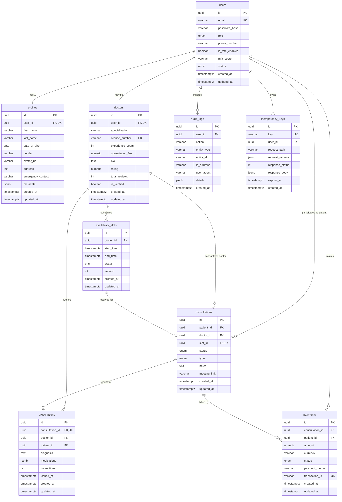
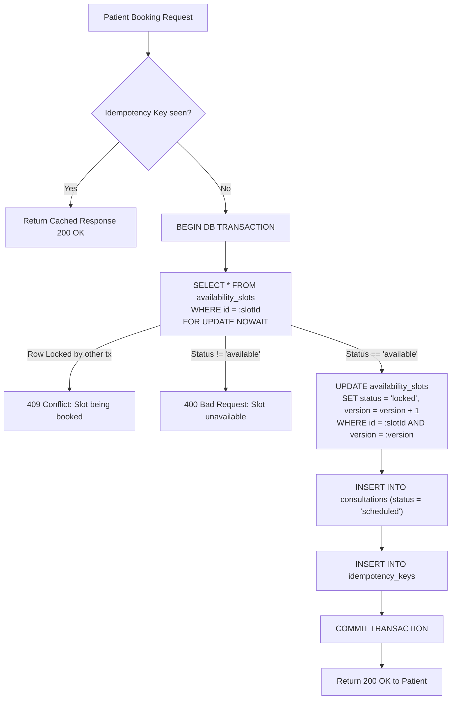

# Amrutam Telemedicine System — Comprehensive Database Structure & Schema

> **Target Database**: PostgreSQL 16+ (AWS Neon Pooler)  
> **Target Scale**: 100,000 daily consultations (~36.5M annual consultations)  
> **Design Goals**: ACID Compliance, High Concurrency (Zero Overbooking), Sub-200ms Search Queries, Immutable Audit Records  

---

## 1. Entity Relationship (ER) Diagram



---

## 2. Table Specifications & Data Dictionary

---

### 2.1 Table: `users`
- **Module**: Module 1 (User Lifecycle, Auth & RBAC)
- **Description**: Stores primary user accounts, credentials, role definitions, and MFA security status.

| Column | Data Type | Nullable | Default | Constraints / Index | Description |
| :--- | :--- | :---: | :--- | :--- | :--- |
| `id` | `UUID` | No | `gen_random_uuid()` | **PRIMARY KEY** | Unique user identifier |
| `email` | `VARCHAR(255)` | No | — | **UNIQUE**, Index | User email address (case-insensitive) |
| `password_hash` | `VARCHAR(255)` | No | — | — | Bcrypt hashed password |
| `role` | `user_role` (ENUM) | No | `'patient'` | Values: `'patient'`, `'doctor'`, `'admin'` (Stored as 4-byte integer OID) | User system role |
| `phone_number` | `VARCHAR(30)` | Yes | `NULL` | Index | International format phone number |
| `is_mfa_enabled` | `BOOLEAN` | No | `FALSE` | — | Indicates if 2FA/TOTP is active |
| `mfa_secret` | `VARCHAR(255)` | Yes | `NULL` | — | Encrypted TOTP secret key |
| `status` | `user_status` (ENUM) | No | `'active'` | Values: `'active'`, `'inactive'`, `'suspended'` | Account standing |
| `created_at` | `TIMESTAMPTZ` | No | `NOW()` | Index | Account creation timestamp |
| `updated_at` | `TIMESTAMPTZ` | No | `NOW()` | — | Last account update timestamp |

**Indexes**:
- `idx_users_email` (B-Tree on `LOWER(email)`) — Fast login lookup.
- `idx_users_role_status` (B-Tree on `(role, status)`) — Admin filtering.

---

### 2.2 Table: `profiles`
- **Module**: Module 1 (User Lifecycle)
- **Description**: Personal, demographic, and medical background info for users (patients and doctors).

| Column | Data Type | Nullable | Default | Constraints / Index | Description |
| :--- | :--- | :---: | :--- | :--- | :--- |
| `id` | `UUID` | No | `gen_random_uuid()` | **PRIMARY KEY** | Unique profile identifier |
| `user_id` | `UUID` | No | — | **FK $\rightarrow$ users(id) ON DELETE CASCADE**, **UNIQUE** | 1:1 link to user |
| `first_name` | `VARCHAR(100)` | No | — | Index | User first name |
| `last_name` | `VARCHAR(100)` | No | — | Index | User last name |
| `date_of_birth` | `DATE` | Yes | `NULL` | — | User date of birth |
| `gender` | `VARCHAR(20)` | Yes | `NULL` | Check: `IN ('male', 'female', 'other')` | User gender |
| `avatar_url` | `VARCHAR(500)` | Yes | `NULL` | — | Profile picture URL |
| `address` | `TEXT` | Yes | `NULL` | — | Residential address |
| `emergency_contact`| `VARCHAR(50)` | Yes | `NULL` | — | Emergency phone/name |
| `metadata` | `JSONB` | Yes | `'{}'` | GIN Index | Dietary preferences, Prakriti (Vata/Pitta/Kapha) |
| `created_at` | `TIMESTAMPTZ` | No | `NOW()` | — | Profile creation timestamp |
| `updated_at` | `TIMESTAMPTZ` | No | `NOW()` | — | Profile update timestamp |

**JSONB Schema (`metadata`)**:
```json
{
  "blood_group": "B+",
  "prakriti": "Pitta-Kapha",
  "allergies": ["Dust", "Penicillin"],
  "chronic_conditions": ["Mild Hypertension"]
}
```

---

### 2.3 Table: `doctors`
- **Module**: Module 2 (Doctor Profiles & Availability)
- **Description**: Doctor credentials, Ayurvedic specialization, experience, verified status, and pricing.

| Column | Data Type | Nullable | Default | Constraints / Index | Description |
| :--- | :--- | :---: | :--- | :--- | :--- |
| `id` | `UUID` | No | `gen_random_uuid()` | **PRIMARY KEY** | Unique doctor identifier |
| `user_id` | `UUID` | No | — | **FK $\rightarrow$ users(id) ON DELETE CASCADE**, **UNIQUE** | Link to user record |
| `specialization` | `VARCHAR(100)` | No | — | Index | Primary Ayurveda branch |
| `license_number` | `VARCHAR(100)` | No | — | **UNIQUE** | Medical council registration number |
| `experience_years`| `INT` | No | `0` | Check: `>= 0` | Clinical practice experience |
| `consultation_fee`| `NUMERIC(10,2)`| No | `500.00` | Check: `>= 0`, Index | Consultation fee in INR |
| `bio` | `TEXT` | Yes | `NULL` | — | Biography, qualifications, degrees |
| `rating` | `NUMERIC(3,2)` | No | `0.00` | Check: `>= 0.00 AND <= 5.00`, Index | Average star rating (1.00 to 5.00) |
| `total_reviews` | `INT` | No | `0` | Check: `>= 0` | Total verified patient reviews |
| `is_verified` | `BOOLEAN` | No | `FALSE` | Index | Verification flag by Amrutam admin |
| `created_at` | `TIMESTAMPTZ` | No | `NOW()` | — | Record creation timestamp |
| `updated_at` | `TIMESTAMPTZ` | No | `NOW()` | — | Record update timestamp |

**Indexes for Search SLA (p95 < 200ms)**:
- `idx_doctors_search`: Composite B-Tree `(specialization, is_verified, rating DESC, consultation_fee ASC)`.

---

### 2.4 Table: `availability_slots`
- **Module**: Module 2 & 3 (Availability & Concurrency Engine)
- **Description**: Doctor calendar slots. Implements **Optimistic Locking via `version`** to prevent double bookings.

| Column | Data Type | Nullable | Default | Constraints / Index | Description |
| :--- | :--- | :---: | :--- | :--- | :--- |
| `id` | `UUID` | No | `gen_random_uuid()` | **PRIMARY KEY** | Unique slot identifier |
| `doctor_id` | `UUID` | No | — | **FK $\rightarrow$ doctors(id) ON DELETE CASCADE** | Doctor offering the slot |
| `start_time` | `TIMESTAMPTZ` | No | — | Index | Slot start time |
| `end_time` | `TIMESTAMPTZ` | No | — | Check: `end_time > start_time` | Slot end time |
| `status` | `VARCHAR(20)` | No | `'available'` | Check: `IN ('available', 'locked', 'booked', 'cancelled')` | Slot status |
| `version` | `INT` | No | `1` | Check: `>= 1` | Optimistic locking version number |
| `created_at` | `TIMESTAMPTZ` | No | `NOW()` | — | Slot creation timestamp |
| `updated_at` | `TIMESTAMPTZ` | No | `NOW()` | — | Slot update timestamp |

**Concurrency & Indexing Rules**:
- `idx_slots_doctor_time_status`: Composite `(doctor_id, start_time, status)`.
- `idx_slots_lookup`: Partial index `WHERE status = 'available'` for ultra-fast available slot queries.
- Optimistic locking query:
  ```sql
  UPDATE availability_slots 
  SET status = 'locked', version = version + 1, updated_at = NOW() 
  WHERE id = $1 AND status = 'available' AND version = $2;
  ```

---

### 2.5 Table: `consultations`
- **Module**: Module 4 (Consultation Lifecycle)
- **Description**: Core transaction record linking patient, doctor, scheduled slot, session state, and video links.

| Column | Data Type | Nullable | Default | Constraints / Index | Description |
| :--- | :--- | :---: | :--- | :--- | :--- |
| `id` | `UUID` | No | `gen_random_uuid()` | **PRIMARY KEY** | Unique consultation identifier |
| `patient_id` | `UUID` | No | — | **FK $\rightarrow$ users(id) ON DELETE RESTRICT** | Patient user ID |
| `doctor_id` | `UUID` | No | — | **FK $\rightarrow$ doctors(id) ON DELETE RESTRICT** | Doctor ID |
| `slot_id` | `UUID` | No | — | **FK $\rightarrow$ availability_slots(id)**, **UNIQUE** | Bound availability slot |
| `status` | `VARCHAR(20)` | No | `'scheduled'` | Check: `IN ('scheduled', 'in_progress', 'completed', 'cancelled', 'no_show')` | Lifecycle status |
| `type` | `VARCHAR(20)` | No | `'video'` | Check: `IN ('video', 'audio', 'chat')` | Telemedicine mode |
| `notes` | `TEXT` | Yes | `NULL` | — | Clinical notes (SOAP format) |
| `meeting_link` | `VARCHAR(500)` | Yes | `NULL` | — | Secure meeting room URL / token |
| `created_at` | `TIMESTAMPTZ` | No | `NOW()` | Index (Partitioning Key) | Booking creation timestamp |
| `updated_at` | `TIMESTAMPTZ` | No | `NOW()` | — | Last modification timestamp |

**Indexes**:
- `idx_consultations_patient`: `(patient_id, status, created_at DESC)`
- `idx_consultations_doctor`: `(doctor_id, status, created_at DESC)`

---

### 2.6 Table: `prescriptions`
- **Module**: Module 5 (Prescriptions & EHR)
- **Description**: Immutable Ayurvedic medical prescription issued by a doctor upon consultation completion.

| Column | Data Type | Nullable | Default | Constraints / Index | Description |
| :--- | :--- | :---: | :--- | :--- | :--- |
| `id` | `UUID` | No | `gen_random_uuid()` | **PRIMARY KEY** | Unique prescription identifier |
| `consultation_id`| `UUID` | No | — | **FK $\rightarrow$ consultations(id) ON DELETE CASCADE**, **UNIQUE** | 1:1 consultation link |
| `doctor_id` | `UUID` | No | — | **FK $\rightarrow$ doctors(id)** | Issuing doctor |
| `patient_id` | `UUID` | No | — | **FK $\rightarrow$ users(id)** | Recipient patient |
| `diagnosis` | `TEXT` | No | — | — | Ayurvedic diagnosis (Nidana) |
| `medications` | `JSONB` | No | `'[]'` | GIN Index | Array of prescribed herbal remedies |
| `instructions` | `TEXT` | Yes | `NULL` | — | Lifestyle & Pathya-Apathya guidance |
| `issued_at` | `TIMESTAMPTZ` | No | `NOW()` | — | Date/time prescription signed |
| `created_at` | `TIMESTAMPTZ` | No | `NOW()` | — | Record creation timestamp |
| `updated_at` | `TIMESTAMPTZ` | No | `NOW()` | — | Record update timestamp |

**JSONB Schema (`medications`)**:
```json
[
  {
    "name": "Triphala Guggulu",
    "dosage": "2 tablets",
    "frequency": "Twice daily",
    "timing": "After meals with warm water",
    "duration_days": 15,
    "special_instructions": "Avoid sour foods during the course"
  },
  {
    "name": "Brahmi Vati",
    "dosage": "1 tablet",
    "frequency": "Once daily",
    "timing": "Before bedtime with warm milk",
    "duration_days": 30
  }
]
```

---

### 2.7 Table: `payments`
- **Module**: Module 6 (Payments & Saga Billing)
- **Description**: Financial transaction ledger recording consultation payments, gateways, status, and refund audit.

| Column | Data Type | Nullable | Default | Constraints / Index | Description |
| :--- | :--- | :---: | :--- | :--- | :--- |
| `id` | `UUID` | No | `gen_random_uuid()` | **PRIMARY KEY** | Unique payment record ID |
| `consultation_id`| `UUID` | No | — | **FK $\rightarrow$ consultations(id) ON DELETE RESTRICT** | Associated consultation |
| `patient_id` | `UUID` | No | — | **FK $\rightarrow$ users(id)** | Paying patient |
| `amount` | `NUMERIC(10,2)`| No | — | Check: `amount > 0` | Transaction amount |
| `currency` | `VARCHAR(3)` | No | `'INR'` | — | ISO 4217 Currency Code |
| `status` | `VARCHAR(20)` | No | `'pending'` | Check: `IN ('pending', 'completed', 'failed', 'refunded')` | Payment status |
| `payment_method` | `VARCHAR(50)` | No | `'upi'` | e.g. 'upi', 'card', 'netbanking' | Payment rail |
| `transaction_id` | `VARCHAR(150)`| Yes | `NULL` | **UNIQUE**, Index | Gateway transaction reference |
| `created_at` | `TIMESTAMPTZ` | No | `NOW()` | Index | Payment initiated timestamp |
| `updated_at` | `TIMESTAMPTZ` | No | `NOW()` | — | Payment updated timestamp |

**Indexes**:
- `idx_payments_txn_id`: Unique B-Tree on `transaction_id`.
- `idx_payments_consultation`: `(consultation_id, status)`.

---

### 2.8 Table: `audit_logs`
- **Module**: Module 8 (Compliance & Security Audit)
- **Description**: Immutable append-only audit trail capturing security events, data modifications, and user actions.

| Column | Data Type | Nullable | Default | Constraints / Index | Description |
| :--- | :--- | :---: | :--- | :--- | :--- |
| `id` | `UUID` | No | `gen_random_uuid()` | **PRIMARY KEY** | Unique log event identifier |
| `user_id` | `UUID` | Yes | `NULL` | **FK $\rightarrow$ users(id) ON DELETE SET NULL** | Triggering user (null for guest) |
| `action` | `VARCHAR(100)` | No | — | Index | Event name (e.g. `USER_LOGIN`, `SLOT_BOOKED`) |
| `entity_type` | `VARCHAR(50)` | No | — | Index | Target entity (`consultation`, `prescription`) |
| `entity_id` | `VARCHAR(100)` | Yes | `NULL` | Index | Target entity primary key |
| `ip_address` | `VARCHAR(45)` | Yes | `NULL` | — | Client IPv4 or IPv6 address |
| `user_agent` | `VARCHAR(300)` | Yes | `NULL` | — | Client browser / device user agent |
| `details` | `JSONB` | Yes | `'{}'` | GIN Index | Action metadata, diffs, payload |
| `created_at` | `TIMESTAMPTZ` | No | `NOW()` | Index (Partitioning Key) | Log creation timestamp |

**Indexes**:
- `idx_audit_logs_entity`: `(entity_type, entity_id, created_at DESC)`.
- `idx_audit_logs_user_date`: `(user_id, created_at DESC)`.

---

### 2.9 Table: `idempotency_keys` (PRD Bonus +10 Requirement)
- **Module**: Cross-Cutting Security & Concurrency
- **Description**: Guarantees zero duplicate writes/charges for booking locks, confirms, and payment processing.

| Column | Data Type | Nullable | Default | Constraints / Index | Description |
| :--- | :--- | :---: | :--- | :--- | :--- |
| `id` | `UUID` | No | `gen_random_uuid()` | **PRIMARY KEY** | Unique record identifier |
| `key` | `VARCHAR(100)` | No | — | **UNIQUE**, Index | Client-provided Idempotency-Key header |
| `user_id` | `UUID` | No | — | **FK $\rightarrow$ users(id) ON DELETE CASCADE** | Owner of the request |
| `request_path` | `VARCHAR(255)` | No | — | — | API endpoint URL path |
| `request_params`| `JSONB` | Yes | `NULL` | — | Hash / content of request payload |
| `response_status`| `INT` | Yes | `NULL` | — | Cached HTTP response status code |
| `response_body` | `JSONB` | Yes | `NULL` | — | Cached JSON response body |
| `expires_at` | `TIMESTAMPTZ` | No | — | Index | Expiration TTL (e.g. 24 hours) |
| `created_at` | `TIMESTAMPTZ` | No | `NOW()` | — | Key creation timestamp |

---

## 3. High-Scale Partitioning Plan (100k Consultations / Day)

To ensure queries remain under the **p95 < 200ms** SLA when scaling to millions of rows, range partitioning is applied to the highest-velocity tables:

### 3.1 Consultations Monthly Range Partitioning
```sql
-- Parent Table
CREATE TABLE consultations (
    id UUID NOT NULL DEFAULT gen_random_uuid(),
    patient_id UUID NOT NULL REFERENCES users(id),
    doctor_id UUID NOT NULL REFERENCES doctors(id),
    slot_id UUID NOT NULL REFERENCES availability_slots(id),
    status VARCHAR(20) NOT NULL DEFAULT 'scheduled',
    type VARCHAR(20) NOT NULL DEFAULT 'video',
    notes TEXT,
    meeting_link VARCHAR(500),
    created_at TIMESTAMPTZ NOT NULL DEFAULT NOW(),
    updated_at TIMESTAMPTZ NOT NULL DEFAULT NOW(),
    PRIMARY KEY (id, created_at)
) PARTITION BY RANGE (created_at);

-- Example Monthly Partitions
CREATE TABLE consultations_2026_09 PARTITION OF consultations
    FOR VALUES FROM ('2026-09-01 00:00:00+00') TO ('2026-10-01 00:00:00+00');

CREATE TABLE consultations_2026_10 PARTITION OF consultations
    FOR VALUES FROM ('2026-10-01 00:00:00+00') TO ('2026-11-01 00:00:00+00');
```

---

## 4. Concurrency & Locking Mechanics

### 4.1 Anti-Double-Booking Workflow

