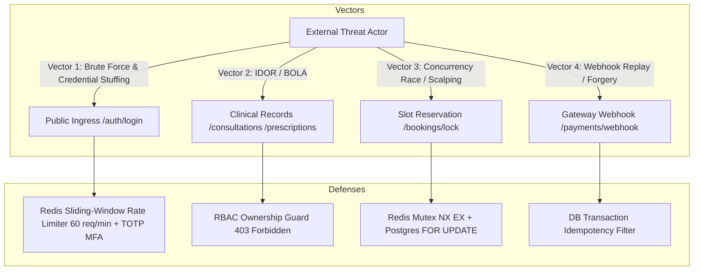

# 🛡️ Deliverable 7: Security Checklist & Threat Model

> **PRD Deliverable #7**: Security checklist and threat model  
> **Compliance Standard**: HIPAA / DISHA Healthcare Data Guidelines & OWASP Top 10 (2021)  
> **Primary Source**: Section 6 of [`ARCHITECTURE.md`](file:///home/suman/Desktop/workplace/amrutum/Amrutam-s-telemedicine-system/ARCHITECTURE.md)

---

## 1. OWASP Top 10 Defensive Implementation Matrix

| OWASP Vulnerability | Threat Description | Amrutam Defensive Control | Enforcement File |
|---|---|---|---|
| **A01: Broken Access Control** | Unauthorized users accessing clinical records or administrative endpoints. | • Role-Based Access Control (RBAC) middleware verifying roles (`patient`, `doctor`, `admin`). • Object-level ownership validation on consultations and prescriptions. • Unmatched access attempts rejected with `403 Forbidden`. | `auth/middleware.js` |
| **A02: Cryptographic Failures** | Compromised credentials or exposed transit data. | • Passwords hashed with **bcrypt** (cost factor 12). • Short-lived JWT Access Tokens (15 min) + Refresh Tokens (7 days). • Enforced TLS 1.3 in transit with `sslmode=require`. | `helper/password.js` `helper/jwt.js` |
| **A03: Injection** | SQL injection targeting database schemas. | • 100% parameterized SQL queries via Knex query builder. • Zero raw string SQL concatenation. • Strict runtime payload validation via Zod schemas. | `helper/schemas.js` `db/db.js` |
| **A04: Insecure Design** | Double-booking slots and duplicate financial charges. | • Two-tier distributed locking (Redis atomic lock `NX EX 600` + PostgreSQL `FOR UPDATE`). • Write idempotency filter (`Idempotency-Key` header cached in Redis). • Choreographed Saga compensating rollbacks. | `controller/bookingController.js` `auth/middleware.js` |
| **A05: Security Misconfiguration** | Default configurations, exposed headers, running as root. | • **Helmet** security headers (HSTS, X-Content-Type-Options, X-Frame-Options: DENY). • Multi-stage Docker execution under unprivileged non-root `USER node` (UID 1000). • CORS whitelist restricted to trusted domains. | `index.js` `Dockerfile` |
| **A06: Vulnerable Components** | Vulnerabilities in open-source third-party dependencies. | • Automated dependency scanning in GitHub Actions CI (`npm audit --audit-level=high`). • Lockfile integrity enforcement via `npm ci --omit=dev`. | `.github/workflows/ci.yml` |
| **A07: Auth & Identification Failures** | Credential stuffing, brute force, token reuse after logout. | • **Multi-Factor Authentication (MFA)** via RFC 6238 TOTP. • Sliding-window rate limiting on login (60 req/min). • Instant token revocation via Upstash Redis blacklist upon logout (`POST /auth/logout`). | `helper/mfa.js` `auth/rateLimiter.js` |
| **A08: Software & Data Integrity** | Alteration of medical prescriptions after consultation. | • Digital prescriptions are **legally immutable** once signed. • Attempted modifications return `409 Conflict`. • Tamper-evident transaction logs. | `controller/prescriptionController.js` |
| **A09: Security Logging & Monitoring** | Undetected breaches or repudiation of medical actions. | • Append-only non-repudiation `audit_logs` table capturing `user_id`, `action`, `entity_type`, `ip_address`, `user_agent`, and state diffs. • Ingress correlation IDs (`X-Correlation-ID`) across all request logs. | `controller/auditController.js` `helper/correlation.js` |

---

## 2. Threat Modeling & Attack Surface Analysis

### Detailed Threat Scenarios & Mitigations:

#### Threat 1: Credential Stuffing & Brute-Force Attacks
- **Target**: `POST /api/v1/auth/login`
- **Mitigation**:
  1. Redis sliding-window rate limiter restricts attempts to 60 req/minute per IP.
  2. RFC 6238 Time-based One-Time Password (TOTP) requires second-factor authorization.
  3. Bcrypt cost factor 12 introduces computational friction against offline dictionary attacks.

#### Threat 2: Broken Object-Level Authorization (BOLA / IDOR)
- **Target**: `GET /api/v1/prescriptions/patient/:id/ehr` and `GET /api/v1/consultations/:id`
- **Mitigation**:
  1. Strict authorization middleware inspects `req.user.id` and `req.user.role`.
  2. Patients can only query their own health records (`req.user.id === requested_patient_id`).
  3. Doctors can only query records of patients with whom they have an active or completed consultation.
  4. Cross-tenant queries are blocked with `403 Forbidden`.

#### Threat 3: Concurrency Race Condition (Slot Scalping & Double Booking)
- **Target**: `POST /api/v1/bookings/lock` and `POST /api/v1/bookings/confirm`
- **Mitigation**:
  1. Tier 1: Redis atomic lock (`SET amrutam:lock:slot:{id} {user_id} NX EX 600`) rejects concurrent contenders in < 5ms with `409 Conflict`.
  2. Tier 2: PostgreSQL pessimistic lock (`SELECT ... FOR UPDATE`) guarantees optimistic version incrementation inside an atomic transaction.

#### Threat 4: Replay Attacks & Duplicate Charges
- **Target**: `POST /api/v1/payments/checkout` and `POST /api/v1/payments/webhook`
- **Mitigation**:
  1. Ingress requests require an `Idempotency-Key` header.
  2. The key and response payload are cached in Redis for 24 hours. Duplicate submissions immediately replay the cached response with `X-Cache: IDEMPOTENT-HIT`.
  3. Gateway webhook transactions verify current status before transitioning, ensuring idempotency.

---

## 3. Data Classification Matrix (PII vs. PHI vs. Financial)

| Data Category | Data Elements Included | Classification Level | Storage & Handling Controls |
|---|---|:---:|---|
| **Personally Identifiable Information (PII)** | • First name, last name • Email address, phone number • Physical postal address | **Confidential** | • Encrypted in transit (TLS 1.3). • Restricted access by RBAC. • Masked in general application logs. |
| **Protected Health Information (PHI)** | • Ayurvedic Dosha diagnosis (Prakriti, Vikriti) • Nadi pulse examination notes • Medical SOAP notes • Herbal prescriptions & dietary guidance | **Strictly Confidential** | • Accessible only by licensed doctor and patient owner. • Legally immutable once consultation completes. • Excluded from marketing/analytics data exports. • Stored with append-only audit trail logging. |
| **Financial Ledger Data** | • Payment transaction IDs • Consultation fees • Refund records • Payment status | **Sensitive** | • Stored in append-only financial ledger. • Credit card PAN/CVV never touch Amrutam servers (handled directly by PCI-DSS compliant gateway). |

---

## 4. Key Rotation & Supply-Chain Security Protocols

1. **Dual-Key JWT Rotation**:
   - The auth verification layer supports dual-key decoding: an active primary key (`JWT_SECRET`) and a fallback transition key (`JWT_SECRET_PREVIOUS`), allowing seamless secret rotation without logging out active users.
2. **Zero Hardcoded Secrets**:
   - Zero credentials or tokens are committed to source control.
   - All runtime variables (`DB_CONNECTION_STRING`, `UPSTASH_REDIS_REST_URL`, `JWT_SECRET`) are injected via Docker Compose or container orchestrator environment secrets.
3. **Automated Supply-Chain Scanning**:
   - Continuous dependency vulnerability scanning via `npm audit --audit-level=high` integrated into every pull request in GitHub Actions.
