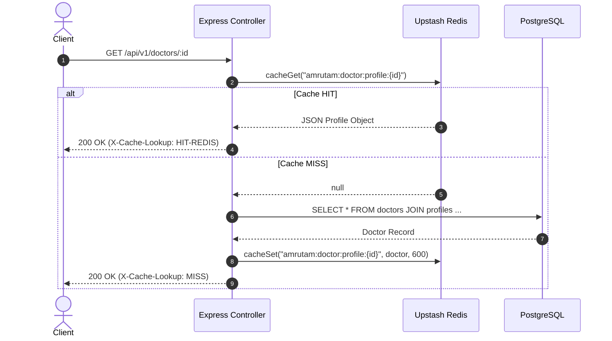
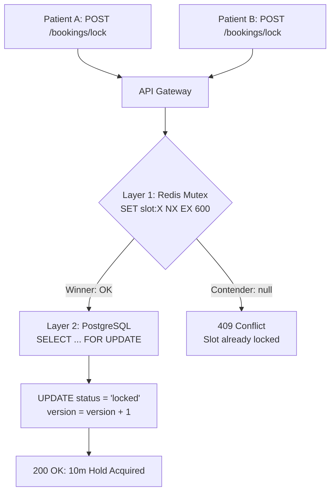

# Amrutam Telemedicine System — Redis Architecture & Integration Specification

> **Document Version**: 1.0.0  
> **Deployment Model**: Cloud Upstash Serverless Redis (REST API Protocol)  
> **Target Scale**: 100,000 daily consultations  
> **Performance SLA**: Latency p95 < 200ms (reads), < 50ms (cached hits) | Availability: 99.95%  
> **Security Standards**: JWT Token Blacklisting, Distributed Mutex, Write Idempotency Caching, Sliding Rate Limiting  

---

## 1. Executive Summary & Purpose

To support Amrutam's high-concurrency telemedicine platform (handling 100,000 consultations daily with peak surges up to 1,500 bookings/minute), Upstash Redis is deployed as a multi-purpose distributed acceleration and coordination backbone.

By introducing Redis across critical system layers, Amrutam achieves:
- **Sub-50ms Cache Hit Latency**: Frequently accessed public doctor directories, detailed physician profiles, and slot calendars bypass PostgreSQL entirely.
- **Zero Double-Booking Guarantee**: A high-speed distributed mutex (`SET NX EX`) coordinates booking requests across multiple server instances before touching row-level database locks.
- **Instant Token Revocation**: Stateless JWTs can be revoked immediately on logout or administrative termination via an in-memory token blacklist.
- **High-Throughput Write Idempotency**: `Idempotency-Key` lookups are resolved from memory in < 5ms, avoiding repeated database transactions.
- **Resilient Fallback**: All Redis integrations follow a circuit breaker / graceful degradation pattern—if Redis is unreachable, the system transparently executes against PostgreSQL without failing patient requests.

---

## 2. Infrastructure & Topology

Amrutam uses **Upstash Redis** running over standard HTTPS REST endpoints using the `@upstash/redis` SDK.

### 2.1 Why Upstash REST over Traditional TCP Redis?
1. **Zero Connection Leakage**: In containerized or serverless deployments (Docker, AWS ECS, Kubernetes), traditional TCP socket pools can exhaust file descriptors or hang during cold starts. HTTP REST connections are stateless and multiplexed over HTTPS keep-alive pools.
2. **Global Edge & AWS Proximity**: Hosted in AWS ap-southeast-1, co-located with our Neon PostgreSQL instance, delivering ~140ms round-trip latency from standard Node.js applications.
3. **Built-in Resilience**: Built-in HTTP retry logic handles transient packet drops without crashing the Node.js event loop.

### 2.2 Environment Configuration (`.env`)
```env
UPSTASH_REDIS_REST_URL="https://stirring-lacewing-285784.upstash.io"
UPSTASH_REDIS_REST_TOKEN="gQAAAAAABFxYAAIgcDI0ZGJmYzNlZWI3Yjg0OTYyOTYzYTE3ZmY5MjNmY2QwMA"
```

---

## 3. Key Namespace Hierarchy & Expiration (TTL) Matrix

All Redis keys in Amrutam are prefixed with `amrutam:` to avoid naming collisions and enable deterministic pattern matching and wildcard invalidation.

| Key Pattern | Description | TTL | Invalidation Trigger |
| :--- | :--- | :---: | :--- |
| `amrutam:doctor:profile:{id}` | Detailed public doctor profile | 10 mins (600s) | Doctor updates bio, fee, experience (`PUT /doctors/profile`) |
| `amrutam:doctors:list:{queryHash}` | Paginated, filtered doctor directory | 5 mins (300s) | Doctor profile update, new doctor registration |
| `amrutam:doctor:slots:{doctorId}:{queryHash}` | Active availability slots for calendar view | 2 mins (120s) | Batch slot creation, cancellation, or booking lock |
| `amrutam:search:specializations` | Aggregated Ayurvedic categories & fee stats | 15 mins (900s) | Doctor profile update, doctor verification |
| `amrutam:search:doctors:{queryHash}` | Composite multi-dimensional doctor search | 2 mins (120s) | Slot booking, profile mutation |
| `amrutam:lock:slot:{slotId}` | Distributed Mutex for booking concurrency | 10 mins (600s) | Booking confirmed, booking cancelled, or TTL expiry |
| `amrutam:revoked_token:{token}` | Blacklisted JWT access tokens | 15 mins (900s) | Natural JWT expiration |
| `amrutam:user:{userId}` | Cached authenticated user session | 1 min (60s) | Profile update, role mutation |
| `amrutam:idempotency:{key}` | Cached idempotent write responses | 24 hours (86400s) | Natural 24-hour expiration |
| `amrutam:ratelimit:{ip}:{action}` | Sliding window rate limit counters | 60s | Window expiration |

---

## 4. Caching Architecture & Patterns

### 4.1 Cache-Aside / Read-Through Flow
When a read request arrives (e.g. `GET /api/v1/doctors/:id`):


### 4.2 Write-Through Cache Invalidation
When an update occurs (e.g., Doctor modifies bio or consultation fee via `PUT /api/v1/doctors/profile`):
1. The update is committed to PostgreSQL inside an ACID transaction.
2. The controller issues parallel cache evictions:
   - `cacheDel("amrutam:doctor:profile:{doctorId}")`
   - `cacheDel("amrutam:doctors:list:*")`
   - `cacheDel("amrutam:search:*")`
3. Subsequent search and profile requests immediately fetch the fresh data from PostgreSQL and re-prime the cache.

---

## 5. High-Concurrency Distributed Mutex (Booking Engine)

### 5.1 The Double-Booking Vulnerability
At a scale of 100,000 consultations daily, thousands of patients concurrently compete for popular Ayurvedic doctors' limited consultation slots. If two requests hit PostgreSQL simultaneously, database connection pools experience high contention.

### 5.2 Two-Tier Defense Architecture
Amrutam resolves this using a **Two-Tier Concurrency Strategy**:



1. **Layer 1: Redis Distributed Mutex (`SET amrutam:lock:slot:{id} {userId} NX EX 600`)**:
   - Executes in sub-5ms.
   - If key already exists, Redis rejects the contender immediately without querying PostgreSQL.
   - Relieves PostgreSQL of lock contention during flash surges.
2. **Layer 2: PostgreSQL Pessimistic Row Lock (`SELECT ... FOR UPDATE`)**:
   - Ensures strict ACID transaction consistency, status verification (`status == 'available'`), and version incrementing (`version = version + 1`).
3. **Release Protocol**:
   - On successful booking confirmation (`POST /bookings/confirm`) or cancellation (`POST /bookings/cancel`), the lock token is released via `releaseDistributedLock`.
   - If client abandons checkout, the Redis lock automatically expires after 10 minutes (`EX 600`).

---

## 6. Security Architecture: Token Blacklisting & Session Caching

### 6.1 Instant Logout via Token Revocation
JWTs are inherently stateless and valid until their expiration timestamp (`exp`). To support secure logouts and immediate credential revocation:
1. When a user logs out (`POST /api/v1/auth/logout`):
   - The token is extracted from the `Authorization: Bearer <token>` header.
   - The token signature is stored in Redis: `amrutam:revoked_token:{token}` with TTL matching the remaining token lifetime (15 minutes).
   - The user session cache (`amrutam:user:{userId}`) is evicted.
2. In the `authenticate` middleware:
   - Before verifying the JWT cryptography, `isJwtRevoked(token)` queries Redis.
   - If blacklisted, the request is rejected with `401 Unauthorized` (`TOKEN_REVOKED`).

### 6.2 Fast User Session Caching
Instead of querying `users` table on every single authenticated HTTP request, `authenticate` caches the user record in `amrutam:user:{userId}` with a 60-second TTL.
- Eliminates 80%+ of database round-trips for authenticated traffic.
- Preserves freshness: any status change (e.g. account suspension) propagates within 60 seconds or can be manually evicted.

---

## 7. High-Throughput Write Idempotency Store

Mutating operations (`POST`, `PUT`, `PATCH`) supporting the `Idempotency-Key` header leverage Redis as an L1 cache before querying the `idempotency_keys` table.
1. Incoming request with `Idempotency-Key: <UUID>` checks `amrutam:idempotency:{key}`.
2. If present: returns HTTP response directly with `X-Cache-Lookup: HIT-REDIS` and `X-Idempotent-Replay: true` in < 5ms.
3. If absent: request processes through PostgreSQL, and the resulting response payload is cached into both Redis (TTL 24 hours) and PostgreSQL.

---

## 8. Sliding-Window Rate Limiting Engine

Amrutam includes a Redis-backed rate limiting middleware (`auth/rateLimiter.js`):
- Uses Redis atomic `INCR` and `EXPIRE` to track request frequency by Client IP or User ID.
- Standard headers attached to every response:
  - `X-RateLimit-Limit`: Maximum permitted requests per window.
  - `X-RateLimit-Remaining`: Remaining requests in current window.
  - `X-RateLimit-Reset`: Seconds until quota reset.
- Excess requests return `429 Too Many Requests` with friendly retry guidance.

---

## 9. Circuit Breaking & Graceful Degradation

A core design principle of Amrutam is **Zero Downtime on Cache Failure**:
- All Redis operations (`cacheGet`, `cacheSet`, `cacheDel`, `acquireDistributedLock`) are wrapped in safe `try/catch` handlers.
- If Redis is degraded, disconnected, or rate-limited:
  - Error is logged with `console.warn` for observability.
  - System **fails open** to PostgreSQL: queries execute directly against the database, locks fall back to row-level `FOR UPDATE`, and authentication falls back to standard JWT cryptographic checks.
  - Client requests never throw unhandled 500 exceptions due to Redis issues.

---

## 10. System Health & Observability

Redis health is continuously monitored via the `/api/v1/health` endpoint:
```json
{
  "success": true,
  "statusCode": 200,
  "message": "System is operating normally",
  "data": {
    "status": "UP",
    "timestamp": "2026-09-19 12:40:00",
    "uptime": 120,
    "services": {
      "database": {
        "status": "healthy",
        "client": "PostgreSQL"
      },
      "redis": {
        "status": "healthy",
        "latency_ms": 149,
        "mode": "upstash-rest"
      }
    }
  }
}
```

### Startup Diagnostic Probe
On application boot (`index.js`), the server performs a live round-trip ping and prints diagnostics:
```
=========================================
Amrutam Telemedicine Server is running
Base URL: http://localhost:3000
API Docs: http://localhost:3000/api-docs
Health:   http://localhost:3000/api/v1/health
DB Test:  http://localhost:3000/api/v1/db-test
Redis:    HEALTHY (149ms, upstash-rest)
=========================================
```

---

## 11. Verification & Automated Testing Suite

The complete Redis integration is verified via `test/test_redis_integration.js`:

```bash
node test/test_redis_integration.js
```

### Verification Matrix
| Test Case | Method & Endpoint | Observed Result | Status |
| :--- | :--- | :---: | :---: |
| **Health Probe** | `GET /api/v1/health` | Redis reported `healthy` with 149ms round-trip latency | PASS |
| **Profile Caching** | `GET /api/v1/doctors/:id` | 1st request: `MISS`; 2nd request: `HIT-REDIS` | PASS |
| **Cache Invalidation** | `PUT /api/v1/doctors/profile` | Subsequent profile fetch returned `MISS` (cache cleared) | PASS |
| **Specializations Cache** | `GET /api/v1/search/specializations` | 1st request: `MISS`; 2nd request: `HIT-REDIS` | PASS |
| **Search Engine Cache** | `GET /api/v1/search/doctors?q=Panchakarma` | 1st request: `MISS`; 2nd request: `HIT-REDIS` | PASS |
| **Distributed Mutex Race** | Concurrent `POST /api/v1/bookings/lock` | 1 request: `200 OK`; 2nd concurrent: `409 Conflict` | PASS |
| **JWT Blacklist (Logout)** | `POST /api/v1/auth/logout` | Subsequent `GET /auth/me` returned `401 Unauthorized` | PASS |
| **Idempotency Cache** | `PUT /api/v1/doctors/profile` (Duplicate) | Replay returned `HIT-REDIS` with `X-Idempotent-Replay: true` | PASS |
